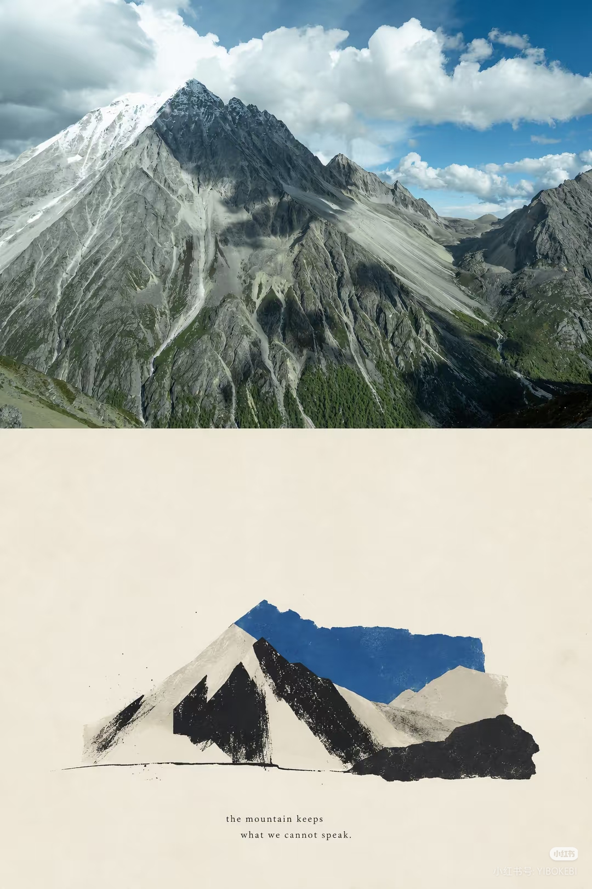
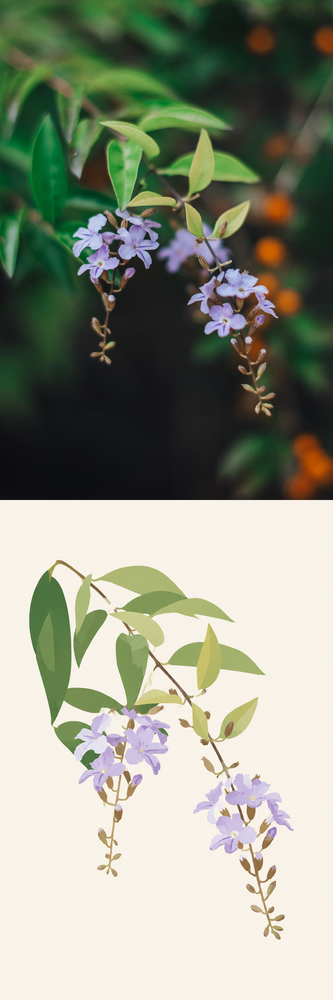
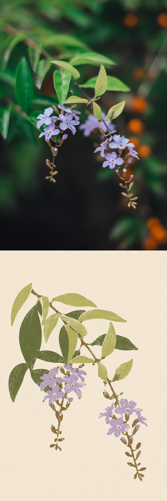
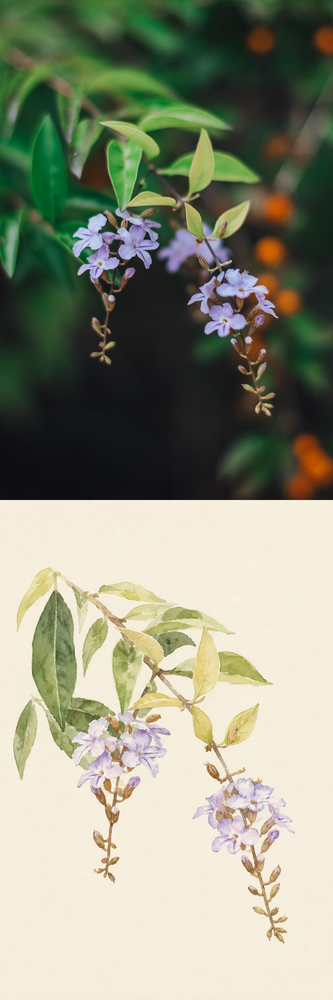

# photo-print-pairs

将照片转为拼贴、拓印、平面抽象、丝网印刷或轻透插画，并保存为**上方原照片、下方艺术效果**的一张 PNG。

这是一个 Codex skill 仓库，包含风格规则、生成计划、版本记录、离线预览和确定性拼接工具。艺术效果由当前环境可用的图片生成工具完成；Python 脚本负责组织提示词、尺寸适配、拼接和文件验证。

下面是随仓库保存的风格参考样例：上方为照片，下方为目标艺术效果。它是原始参考，不是本仓库测试生成的结果。



此前实际生成的结果单独保存在 **[examples/generated-pairs](examples/generated-pairs/README.md)**：A、B 两种风格各 3 张，共 6 张完整上下拼接 PNG。文件夹中提供分组预览、尺寸、简评和原照片来源。

新增三种风格使用同一张照片试生成，方便比较表现方式。点击查看完整上下对照；[试生成记录](examples/style-trials/README.md)保存实际提示词、尺寸与评价。

| C · 平面抽象 | D · 有限色丝网印刷 | E · 轻透插画 |
| --- | --- | --- |
| [](examples/style-trials/C-pair.png) | [](examples/style-trials/D-pair.png) | [](examples/style-trials/E-pair.png) |

## 能做什么

- 五种基础风格：A 撕纸拼贴 / 干刷版画、B 颗粒拓印 / 流动消散、C 平面抽象、D 有限色丝网印刷、E 轻透插画。
- 11 条扩展路线：9 条艺术化路线、1 种邮票版式和 1 种胶片调色，按实际参考选择；见[扩展风格目录](references/extended-styles.md)。
- 支持保留更多细节、适度概括、大胆概括三种意图；主要对象与空间关系继续受保护约束。
- 单张或批量处理，默认每张一种风格；按需生成多版，或为整组复用配色、纸底与概括程度。
- 默认输出原图宽度不变、高度翻倍的独立 PNG，原照片不裁切、不缩放。
- 支持固定参考尺寸、等比留边和经人工确认的艺术区纸面裁切。
- 保存提示词、版本选择、输出尺寸和哈希，每种风格分别记录参考一致性、主体保留和审美评价。
- 离线预览中查看大图、标记保留 / 修改 / 放弃，导出意见后继续对应版本；新一批可导入旧评价。
- 将“太写实”“主体少了”等反馈转成具体修订计划，保留前一版提示词和用户要求继续保留的部分。
- 可额外导出与下半区相同的独立效果图，方便使用。

默认原尺寸模式会验证上方照片的 RGB 像素。生成区域的主体保留和风格效果另做视觉评价，文件检查通过不等于艺术效果合格。

## 安装为 Codex skill

需要 Python 3.9 或更新版本。拼接工具依赖 Pillow，安装脚本只使用 Python 标准库。

```bash
git clone https://github.com/Ruye-aa/photo-print-pairs.git
cd photo-print-pairs
python3 scripts/install_skill.py
```

安装脚本优先使用 CODEX_HOME 指定的目录，否则安装到当前用户的 ~/.codex/skills/photo-print-pairs。它仅复制 skill 所需文件，不复制 Git 历史、测试和仓库维护文件。

已有相同版本时直接复用。需要更新已有版本时运行：

```bash
python3 scripts/install_skill.py --replace
```

更新前会把原目录完整保留到 skills 旁边的 skill-backups 目录，避免旧版本混入已安装技能。自定义安装目录使用旁边的 .skill-backups 目录。可用 --target 指定一个完整的 skill 目标目录。安装后在新任务中调用；若当前应用尚未刷新技能列表，重新打开任务再试。

## 在 Codex 中使用

提供照片或一个照片文件夹，然后输入：

> 使用 $photo-print-pairs，按参考风格生成上下拼接图，保存到图片/生成。

可以补充“使用 A 风格”“每张各生成 A、B 两种”“尺寸与这张参考一致”或“只保存已有拼接图”。

也可以直接描述想要的结果：

> 用平面抽象处理这张照片，画面清爽一些，保留主要对象和它们的位置。

> 这组照片用有限色丝网印刷，统一纸底和色调，生成后给我一个可挑选的预览。

> 这一版花瓣太碎，合并内部细节，保留两串花的位置。另存新版本。

默认无文字、不新增装饰对象，约束主体数量、方向、相对位置和遮挡。没有指定风格时从 A/B 中逐图选择；C/D/E 可按名称或效果描述选择。概括程度由提示词表达，实际强度仍需看生成结果。若图片生成工具不可用，skill 会说明限制；不会自动改用需要额外凭据的图片 API。

完整行为约定见 [SKILL.md](SKILL.md)。

## 使用扩展路线

[扩展风格目录](references/extended-styles.md)包含蜡笔小幅插画、彩色轮廓涂鸦、手塑黏土、超现实摄影拼贴、动漫转绘、City Pop、针织毛绒、塑料积木和像素拉伸彩带。邮票明信片归为版式，清新胶片归为调色，不计为新增绘画材质。机器规则保存在 [extended-styles.json](references/extended-styles.json)。

这些路线使用独立的计划入口。先查看照片和实际参考，再填写主体、保留项及可简化部分；`--preserve` 与 `--simplify` 均可重复：

```bash
python3 scripts/prepare_extended.py --list

python3 scripts/prepare_extended.py \
  --photo /path/to/photo.jpg --style crayon-vignette \
  --subject "两簇下垂紫花、相连枝条和绿叶" \
  --preserve "保留两簇花左高右低的位置关系" \
  --preserve "保留花梗与枝条连接" \
  --simplify "省略失焦背景，合并细碎叶脉" \
  --output /path/to/crayon-plan.json
```

命令只生成计划 JSON。把完整 `prompt` 和内容照片交给当前可用的 `image_gen`，实际生成的文件、尺寸和视觉结果需要另行核验。计划中的分辨率是请求，不保证生成工具精确返回；最终 W×2H 尺寸由本地拼接工具落实。同路径同内容计划可复用，不同内容会报错，应另存新版本。

`surreal-photo-collage` 与 `pixel-stretch` 需要已授权的 `--allow-recompose`：前者允许重排已有主体并重置为简单纸色背景；后者只允许一条抽象彩带，继续保留原场景几何关系。两者都不允许增加人物、实物或新的场景。该参数不会扩大其他路线的编辑范围。

扩展计划与 A–E 的计划格式独立。拼接扩展结果时使用普通 `compose_pair.py --photo ... --artwork ... --output ...`，暂不传 `--plan`；把扩展计划与成品一同保存。生成与修订记录见[扩展路线试生成](examples/research-trials/README.md)，采集来源、覆盖范围和限制见[采集记录](references/research/2026-09-06/collection.md)。

## 单独运行拼接工具

已有原照片与效果图时，不需要图片生成服务，可直接拼接。

```bash
python3 -m venv .venv
source .venv/bin/activate
python3 -m pip install -r requirements.txt

python3 scripts/compose_pair.py \
  --photo /path/to/photo.jpg \
  --artwork /path/to/artwork.png \
  --output /path/to/results/photo_A.png
```

Windows 可使用 .venv\\Scripts\\activate 激活环境，或直接使用虚拟环境中的 Python。

| 模式 | 输入与输出 | 上方照片 |
| --- | --- | --- |
| 默认原尺寸 | W×H → W×2H | 方向校正后保留解码 RGB 像素 |
| 固定参考尺寸 | --size 1080x1620 | 等比缩放、居中留边 |
| 奇数总高度 | 如 --size 1080x1451 | 上方 725 像素，下方 726 像素 |

效果图始终等比适配，不进行非等比拉伸。默认完整保留艺术图并补暖白底。可用参数：

| 参数 | 用途 |
| --- | --- |
| --size WIDTHxHEIGHT | 指定最终单张 PNG 的总尺寸 |
| --paper-color '#EEE8DA' | 指定留边底色 |
| --art-crop L,T,R,B | 裁去已查看确认的艺术区空白，坐标基于方向校正后的艺术图 |
| --paper-sample L,T,R,B | 用已确认的空白纸底矩形补边；不能包含主体或文字 |
| --record /path/to/new.json | 自定义新记录文件，默认写入输出目录的 .records/ |
| --plan /path/to/plan.json | 关联 A–E 生成计划，核对源照片哈希和尺寸 |
| --export-artwork | 额外保存适配后的下半区 PNG |

同名同内容复用已有 PNG；同名不同内容另存为 _v2、_v3 等版本。原照片和效果图文件均不会被覆盖。记录包含实际尺寸、输入与输出哈希、适配范围和像素检查结果。

“原照片像素保留”指 EXIF 方向校正并解码成 RGB 后的数值一致，不代表保留 JPEG 编码、EXIF、透明度或印刷色彩配置。固定尺寸模式可能缩放照片，放大导出也不会增加真实细节。

## 生成计划与批量预览

在 Codex 中使用时，助手负责查看照片并填写内容描述，用户无需编辑 JSON。需要脚本化保存和检查时，参考 [workflow-example.json](references/workflow-example.json)，填写本张照片的主体、保留项、可简化部分、空间关系、配色和构图，再编译计划：

```bash
python3 scripts/plan_artwork.py \
  --photo /path/to/photo.jpg --brief /path/to/brief.json \
  --style C --strength balanced --output /path/to/plan.json
```

计划文件中的 `prompt` 交给图片生成工具执行。该命令本身不会生成图片，也不会请求图片服务。将返回的艺术图通过 `compose_pair.py --plan /path/to/plan.json` 拼接，生成记录会保存完整计划。

批次完成后生成一个自带图片的离线 HTML：

```bash
python3 scripts/review_gallery.py \
  --records /path/to/results/.records \
  --output /path/to/results/review.html
```

打开页面即可看大图、挑选结果、写修改意见并导出 `review.json`。新增版本后重建预览，可增加 `--review /path/to/review.json` 继承未变化图片的评价；新图片仍待评价。

系列配置、参考图、自然语言修订和评价导入的完整命令见[工作流说明](references/workflow.md)。具体风格选择与失败处理见[风格指南](references/style-guide.md)。

## 参考与效果评价

仓库保留 13 张用户提供的原始参考图；这些图都是上下对照，生成时只使用下方艺术区的风格。

- [参考目录与逐张分析](references/style-catalog.md)
- [参考尺寸与文件哈希](references/reference-manifest.json)
- [通用提示词与两种风格模板](references/prompting.md)
- [五种风格与修订指南](references/style-guide.md)
- [可执行的风格规则](references/style-recipes.json)
- [22 组历史提示词和修订记录](references/prompt-examples.json)
- [历史验证与失败案例](references/validation-notes.md)
- [6 张实际生成的上下拼接结果](examples/generated-pairs/README.md)
- [C/D/E 新风格试生成](examples/style-trials/README.md)
- [11 条扩展路线与参考说明](references/extended-styles.md)
- [扩展路线试生成与逐风格评价](examples/research-trials/README.md)
- [小红书及官网采集记录](references/research/2026-09-06/collection.md)

每种新风格适配后，都要用实际生成图完成三类评价，分别保留证据：

- 参考一致性：注明实际查看的参考来源、页码或视频时间点，指出材质、线条、留白和构图中符合及偏离的部分。
- 主体保留：对照输入照片，核查数量、身份特征、相对位置、方向及计划允许省略的内容；不因换成艺术材质就默认结构正确。
- 审美：分别评价构图层次、配色、质感和完整度，给出具体画面依据。使用分数时注明评分锚点和主观判断性质，不能称为客观模型分或用户验收。

失败、修订和最后选择的版本都要保留，不能只展示满意版本而抹除失败记录。一次候选的文件检查或视觉评价通过，只说明这张输入和这个版本的表现，不代表跨题材稳定验收。每条路线的实际状态以试生成记录为准。

网上采集的第三方图片、视频和截图保存在本地 `work/`，不随公开仓库上传。公开记录保留规范来源链接、页码或实际视频 PTS、尺寸、哈希和采集方式，移除访问令牌与本机路径。图片下载失败时可保存浏览器图片区域截图，并标明截图及失败原因；视频帧记录其实际解码时间点，不能把几个关键帧写成完整视频采集。

历史验证覆盖 16 张输入、22 个目标版本和 3 次额外修订。紫花、单塔较接近参考；复杂街景容易保留过多细节，鱼群出现过小鱼省略。评价来自同一助手的视觉检查，没有独立评审或重复生成稳定性统计，不能将这些候选结果当作通用成功率依据。

新增 C/D/E 已各做一次同源照片试生成，用于检查流程和材质差异，尚未覆盖复杂街景、人物或多对象场景。主体保护、定向修订和成组配色属于生成约束，不能保证模型每次都准确执行。

参考图片随仓库保存用于复现该流程；原始文件未附带完整的作者和许可资料。仓库未为这些图片声明开源许可。

需要从本地恢复参考图时，可按清单重新导入；程序核对文件哈希，缺失或内容不符时停止，不会替换不同的现有图片。

```bash
python3 scripts/import_references.py --source /path/to/reference-folder
```

## 仓库结构

```text
photo-print-pairs/
├── README.md
├── SKILL.md
├── agents/openai.yaml
├── assets/reference-originals/   # 13 张参考原图
├── examples/generated-pairs/     # 实际生成结果，A、B 风格各 3 张
├── examples/style-trials/        # C/D/E 同源试生成与完整提示词
├── examples/research-trials/     # 扩展路线试生成、修订与评价
├── references/                  # 风格、提示词和历史评价
├── scripts/
│   ├── compose_pair.py          # 尺寸适配与上下拼接
│   ├── plan_artwork.py          # 风格、系列和修订计划
│   ├── prepare_extended.py      # 扩展路线的独立生成计划
│   ├── research_media.py        # 本地采集归档与公开来源清单
│   ├── review_gallery.py        # 离线预览与评价导入导出
│   ├── import_references.py     # 从本地导入并核验参考图
│   └── install_skill.py         # 安装与备份更新
├── work/                        # 本地研究原始媒体，不随 Git 上传
├── tests/                       # 不调用图片生成服务的验证
└── requirements.txt
```

## 开发与验证

```bash
python3 -m pip install -r requirements.txt
python3 -m unittest discover -s tests -v
```

测试检查原照片像素、尺寸适配、方向校正、同名保护、计划与照片绑定、修订版本匹配、参考继承、预览文件校验、评价导入、安装更新和参考素材完整性。测试使用临时生成的检查图，不需要照片下载或图片生成 API。

提交风格或提示词变更时，应另用真实照片试生成，并记录内容缺失、构图变化和文字残留。通过拼接测试不能证明生成风格改善。

## 相关项目

- [photo-abstract-editorial](https://github.com/ZzzLc0405/photo-abstract-editorial)
- [gathered-scenes-zine-skill](https://github.com/Zeejay0/gathered-scenes-zine-skill)
- [paper-echo-photo-cards](https://github.com/Yu-0312/paper-echo-photo-cards)
- [paper-signal](https://github.com/jiahuiqu17/paper-signal)
- [zine-poster-skill](https://github.com/jas0nh/zine-poster-skill)
