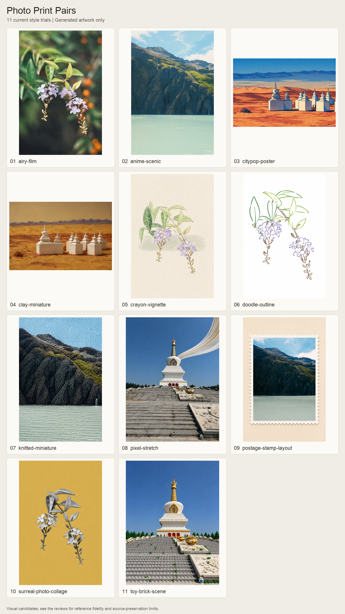

# 扩展风格试生成与评价

本批从小红书和像素蛋糕官方示例中整理了 **11 条扩展路线**，使用 4 张已有许可来源的照片，实际生成 **15 个版本**，每个版本都保存了独立上下拼接 PNG。蜡笔修订 1 次，摄影拼贴修订 2 次，像素拉伸修订 1 次；其余各 1 次。研究从 2026-09-06 开始，评价于 2026-09-07 整理完成。

目前较适合作为候选的是积木、黏土、动漫、City Pop 等。摄影拼贴仍有材质失配；邮票和胶片虽然有较完整的观感，但生成过程改变了照片细节，不能作为严格“只排版”或“只调色”的合格样例。**这里展示的是实际结果与缺陷，选中一个版本不代表通过全部要求。**

## 怎样评价

逐图查看内容原照、生成图和具体参考页或视频帧，分别记录参考一致性、主体保留、审美。审美考虑构图与层次、配色、材质及完成度；不把这些维度与主体保留混成一个总分。表中 0–5 分是助手的主观视觉判断，4 表示较好的候选但仍有具体偏差，3 表示方向可辨但有明显距离，2 表示关键表现失配。它们不是经过校准的客观指标、用户验收或成功率。

参考与输入不是同一题材，因此比较的是线条、材质、色面、留白、分层和版式规则，不计算无意义的逐像素相似度。参考中的杯子、建筑、岩块、装饰文字不能被带入新照片。部分参考是上效果、下照片；本项目仍保持用户要求的上原照、下效果。

每条路线的对应页面、页号、实际视频 PTS 和文件哈希见[参考映射](../../references/research/2026-09-06/style-reference-map.json)。完整评分理由、各审美维度和失败记录见 [evaluation.json](evaluation.json)；实际提示词、输入角色、尺寸、来源与输出哈希见 [manifest.json](manifest.json)。参考原媒体保存在采集机器的本地研究目录，不随公开仓库分发。

## 当前版本

点击风格名称查看完整上下对照。分数顺序独立，不作加权排名。

| 风格 | 参考一致性 | 主体保留 | 审美 | 对照发现与适用限制 |
| --- | ---: | ---: | ---: | --- |
| [蜡笔小幅插画 v2](pairs/crayon-vignette-v2.png) | 4 | 4 | 4 | 细线、露纸颗粒、灰绿短色带与参考接近，紫绿配色柔和。比首版留白更多，但主体仍偏大，中间淡紫残影未清掉；属于带缺陷的候选。 |
| [彩色轮廓涂鸦](pairs/doodle-outline.png) | 3.5 | 4.5 | 4 | 两簇花的斜向关系和主要叶形保留，内部留白清爽。线条比参考狗图更细、更像植物线稿，童趣和粗线节奏较弱。 |
| [手塑黏土微缩](pairs/clay-miniature.png) | 4 | 4 | 4 | 七个塔尖与主要遮挡关系仍在，哑光压痕和柔软边缘能体现黏土。地景偏黄、塔群更居中，局部表面仍接近石膏，需要接受形体概括。 |
| [超现实摄影拼贴 v3](pairs/surreal-photo-collage-v3.png) | 3 | 4 | 3.5 | 黑白、黄底、悬空留白成立，中央花痕已移除；银灰叶面与投影仍像浅浮雕，摄影纸片质感不足。保留为实验性结果，不作为已匹配示范。 |
| [暖光动漫转绘](pairs/anime-scenic.png) | 4 | 4.5 | 4 | 山脊、湖岸和右侧瀑布可对应，平涂层次与柔和光色成立。岩壁碎面仍多，水与云的概括还可更简洁；没有为追求暖光擅自改成日落。 |
| [City Pop 复古插画](pairs/citypop-poster.png) | 4 | 4.5 | 4 | 七塔、深蓝轮廓和印刷颗粒成立，蓝橙对比醒目。比官方参考更偏白昼旅行版画，沙地高饱和纹理略抢主体。 |
| [针织毛绒微缩](pairs/knitted-miniature.png) | 3.5 | 4 | 4 | 山体绞织随体积走向，湖水横向针脚清楚，材质转换充分。天空也铺满针织，整体更像壁毯，参考的微缩景深较弱，瀑布略被强调。 |
| [塑料积木场景](pairs/toy-brick-scene.png) | 4.5 | 4 | 4.5 | 白塔、三扇红门、阶梯与蓝白花瓶可辨，拼缝、凸点与局部高光统一。前景零件偏密，微小游客和金碗未能可靠逐个核对，不能承诺细节全保留。 |
| [邮票明信片版式](pairs/postage-stamp-layout.png) | 4 | 3 | 4.5 | 齿孔边框、暖纸与均衡留白很好看；但内嵌照片比例与源图不同，底部水面未完整保留，岩壁被重绘。仅作生成式版式草图，未通过完整原照排版要求。 |
| [清新胶片调色](pairs/airy-film.png) | 3.5 | 4 | 4 | 明度更柔和，花朵与背景分离较好；叶缘、花缘被重新描绘，黄绿高光和橙色散景略强。不能证明它只改颜色而不改几何。 |
| [像素拉伸彩带 v2](pairs/pixel-stretch-v2.png) | 4 | 4 | 4 | 起点藏在塔肩后，下垂尾段已去除，白金色与主体协调；线纹仍偏金属长条，曲线转折不及参考的 S 形充分。底图细节严格不变也未得到证明。 |

9 条艺术/构图路线中，8 条保留为有明确限制的候选，摄影拼贴保留实验状态。邮票是版式，胶片是调色，不把它们算成两种新绘画材质。本轮每种路线只覆盖一个输入题材，未检验跨题材稳定性；“积木得分较高”只适用于这张白塔样例。

## 修订前后

| 路线 | 版本与参考一致性 | 改善 | 仍未解决 |
| --- | --- | --- | --- |
| 蜡笔 | [v1：3](pairs/crayon-vignette-v1.png) → [v2：4](pairs/crayon-vignette-v2.png) | 大片绿色排线收为短色带，纸色与留白更接近参考 | 主体偏大，中央花痕残留 |
| 摄影拼贴 | [v1：2](pairs/surreal-photo-collage.png) → [v2：2.5](pairs/surreal-photo-collage-v2.png) → [v3：3](pairs/surreal-photo-collage-v3.png) | 从彩色抠图改为黑白黄底，最后去掉中央花痕 | 银灰浅浮雕感仍明显；两次额外修订后停止，保留失败边界 |
| 像素拉伸 | [v1：3.5](pairs/pixel-stretch.png) → [v2：4](pairs/pixel-stretch-v2.png) | 去掉延至树线的尾部，根部遮挡更清楚 | 线纹像金属，S 形不足 |

## 文件与验证

- **15 个单张 PNG** 均在 [pairs](pairs)，上方保留方向校正后的完整原照片，下方是对应效果；没有把总览当作独立成品。
- 源图为 1067×1600、1200×1600 或 1600×1067，最终分别为 **1067×3200、1200×3200、1600×2134**。
- 15 张上半区与对应源图的解码 RGB 像素逐一核验一致。此检查不证明下半区主体或风格合格。
- 生成工具返回尺寸与请求不完全相同，例如摄影拼贴 v3 实际为 1025×1535；拼接时完整等比适配，不拉伸、不开新裁切。放大不表示增加真实细节。
- [sources](sources) 保留 4 张测试原照，[artworks](artworks) 保留 15 个真实返回的效果文件，每个风格最多 3 个版本。

原照来自此前已保存的 Pexels 测试集：高山湖泊（Adrien Olichon）、紫色花枝（Alejandra Montenegro）、荒漠白塔（BYB BYB）、蓝天白塔（Pexels User）。每张的具体页面与许可链接均在 manifest 的 source 字段。源图由此前已验证的上下拼接图上半区逐像素提取，不使用小红书作者作品充当本项目可再分发的测试照片。

## 后续怎么使用

读取[扩展风格规则](../../references/extended-styles.md)，用 `scripts/prepare_extended.py --list` 选择路线，查看当前样例与局限，再为新图填写主体约束。摄影拼贴及像素拉伸需要明确选择重构范围；仅保存原景的任务不会自动使用。保真要求严格的邮票排版或纯调色任务，不能把这里的生成式草图直接视为交付完成。

采集范围、下载与截图记录见[研究说明](../../references/research/2026-09-06/collection.md)。本次搜索快照覆盖 77 篇不同笔记，完整归档其中 9 篇；不是小红书全平台内容穷尽。
